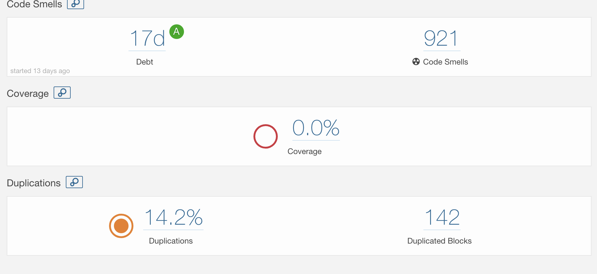
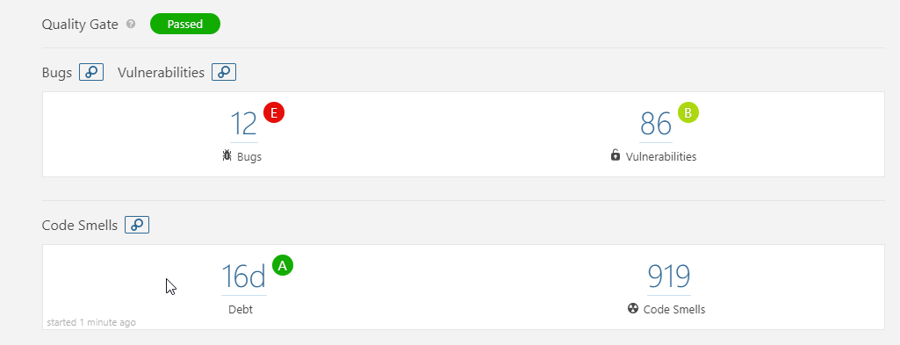

# Individual Milestone 3
## Tobias Alldén

---
Software Quality is often split into internal and external quality. Internal quality is the quality measures related to the code itself, such as complexity, duplications and so forth. External quality is the quality as seen external from the code, such as usefulness for the customer, ease of understanding for the programmer and so forth.

# 1) Bad Smells in the SWEREA System
The SWEREA system contains several artifacts that points towards bad system quality. Some of the identified ones follows.

## External Quality
This is where the system is really lacking in my opinion. As a developer that tries to get into the system, get it running and extend it, there have been multiple obstacles along the way that makes the system less useful for me, i.e. have bad external quality.

### No easy setup
The system is tricky to setup and is not very streamlined. While obstacles like outdated packages and missing dependencies is to be expected from a dormant software, other difficulties arose. As the backend is developed as a .Net- application, there are troubles setting up development on Macintosh machines as the development environments most useful for .net applications are not very mature and cannot be used in a satisfactory manner on Macs. This poses unnecessary delays in getting the system up and running, potentially costing the company large sums of money. (Everyone except 1 in our group uses macs, and none have enough storage to run a windows virtual machine)

Moreover, some parts of the backend-system are inconsistent.. The database model is not up to par with the sql-script that generates the different tables in the database. This also poses an unnecessary time-delay for figuring out how to run the system.

### Poorly documented
Another artifact that reduces the external quality for a developer is just how poorly documented the entire system and their parts are (basically not at all), this forces the developer to have to use techniques such as systematic code reading in a larger extent that being able to rely on code comments and documentation for understanding the system. Further, the installation documentation is lacking as well.


Both of these external quality problems makes the system more difficult to carry on with from a developer standpoint. However, they still contain the features that a customer initially asked for, so from a customer standpoint, the external quality might be good.

## Internal Quality
The internal quality is lacking as well. The bad quality indicators here are duplications, lack of test-coverage and code smells. Sonarqube identifies 13 bugs, 921 Code Smells and 0.0 test coverage in the android frontend alone. Thus my upcoming refactoring activities will be used on the android frontend. A screenshot of the sonarqube scan can be found below.



Examples of the code smells found are
* Final fields that are not static
* Unused local variables
* Lack of default cases in switch-statements

The duplications are mostly related to similar behavior for buttons in different activities. These could potentially be moved into shared action-files.


# Refactoring
I will refactor the android frontend, and try to use the Android-studio automated refactoring as much as possible. The things I will refactor are two code smells and one bug proposed by sonarqube.

## BUG: Remove this conditional structure or edit its code blocks so that they're not all the same.
The file ```loginScreen/loginScreenController.java``` contains a empty if-statement

Previously:

```java
//region Complying with loginScreenInterfaces.lsViewInterface Methods
@Override
public void loginUser(String email, String password)
{
    this.model.loginUser(email,password);
    // Verifying the email is in a valid email format
    if(Patterns.EMAIL_ADDRESS.matcher(email).matches())
    {
        // Send credentials to model

    }
    else
    {
        // Notify user that email is invalid
        //this.view.get().sendMessageToUser(R.string.invalidEMail);
    }
}
```

To refactor this I manually delete the entire if-else block as android studio does not proposes any delete refactoring for the block. This took me about 4 minutes in total.

After:
```java
//region Complying with loginScreenInterfaces.lsViewInterface Methods
@Override
public void loginUser(String email, String password)
{
    this.model.loginUser(email,password);
}
```


### Code Smell: Remove this useless assignment to local variable "pixelsBuffer".
The file ```StlSnapshooter.java``` contains an unnecessary assignment to a array.

Previously:

```java
/**
 * Creates the snapshot of the model
 */
public static void saveSnapshot (final int width, final int height, final ByteBuffer bb ) {
    int screenshotSize = width * height;

    int pixelsBuffer[] = new int[screenshotSize];
    bb.asIntBuffer().get(pixelsBuffer);
    Bitmap bitmap = Bitmap.createBitmap(width, height, Bitmap.Config.RGB_565);
    bitmap.setPixels(pixelsBuffer, screenshotSize-width, -width, 0, 0, width, height);
    pixelsBuffer = null; // THIS ONE...

    short sBuffer[] = new short[screenshotSize];
    ShortBuffer sb = ShortBuffer.wrap(sBuffer);
    bitmap.copyPixelsToBuffer(sb);


...

}
```

To refactor this, i select the line ```pixelsBuffer = null; ``` and do Refactor-> Safe delete. However, this finds two usages of pixelBuffer that are not safe to delete, namely the two usages above. Thus I also have to manually select this line and delete it not to break the functionality of the system. This took me about 2 minutes.

After:
```java
/**
 * Creates the snapshot of the model
 */
public static void saveSnapshot (final int width, final int height, final ByteBuffer bb ) {
    int screenshotSize = width * height;

    int pixelsBuffer[] = new int[screenshotSize];
    bb.asIntBuffer().get(pixelsBuffer);
    Bitmap bitmap = Bitmap.createBitmap(width, height, Bitmap.Config.RGB_565);
    bitmap.setPixels(pixelsBuffer, screenshotSize-width, -width, 0, 0, width, height);

    short sBuffer[] = new short[screenshotSize];
    ShortBuffer sb = ShortBuffer.wrap(sBuffer);
    bitmap.copyPixelsToBuffer(sb);


...

}
```


### Code Smell: Remove this unused "bundleKeyFilename" local variable.
The file ```activities/MainActivity.java``` contains a unused variable.

Before

```java
private void sendArgumentsToFragments(Fragment fragment)
  {
      // Creating bundle keys
      String bundleKeyPersonality = enums.bundleKeys.personalityComm.getValue();
      String bundleKeyController  = enums.bundleKeys.controllerComm.getValue();
      String bundleKeyFilename    = enums.bundleKeys.filenameComm.getValue(); // THIS ONE

      ...
    }
```

To refactor this, I select the variable ```bundleKeyFilename``` and do Refactor->Safe Delete, as Android studio cannot find any other usages for the variable. This is completed. This refactoring activity took me about 30 seconds.

After:
```java
private void sendArgumentsToFragments(Fragment fragment)
  {
      // Creating bundle keys
      String bundleKeyPersonality = enums.bundleKeys.personalityComm.getValue();
      String bundleKeyController  = enums.bundleKeys.controllerComm.getValue();

      ...
    }
```

These refactoring took more manual labour as the Refactoring menu in android studio was not sufficient for some of the tasks. I trust these refactoring as the system does still build and the code removed was mainly unused code. The result is a less cluttered and slightly smaller system.

# 3 New indicators
The previous indicators on the Android frontend was the following:


After the above refactorings the new measures are:



Thus we can see our measures (#bugs (13->12) & #Code smells(921-919)) was made better by our ~7 minute refactoring session. Note that I did not include duplications and duplicated blocks in the second screenshot as these did not change.
