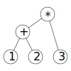

# Lecture 8
## Abstract Data types & Recursive Data types.
The reverse method as given below is not very efficient. Since it calls (++) many times and have to "iterate" the entire list every time.
```haskell
reverse :: [a] -> [a]
reverse [] = []
reverse (x:xs) = reverse xs ++ [x]
```
If we check the computaional time for this we can see that it is high. For example; summing the numbers between 1 and 10000 takes 0.01sec and 2,633,512 bytes, whereas reversing the sum from 1 to 10000 takes 1.56 secs and 4,455,178,368 bytes. Which is conciderably higher.

*We can do this faster.*

```haskell
reverse :: [a] -> [a]
reverse xs = revOnto xs []

-- revOnto xs rs = reverse xs ++ rs
revOnto :: [a] -> [a] -> [a]
revOnto []     rs = rs
revOnto (x:xs) rs = revOnto xs (x:rs)
```
This gives the time of reversing the sum mentioned above of 0.89 secs and 386,901,184bytes. Which is much better.

## Data structures.
Data structures are a way of storing data, some are better than others for specific tasks.
FOr example the queue. Enters at the back. Leaves at the front.
This has the interface
```haskell
data Q a                    -- the type of queues

empty   :: Q a              -- an empty queue
add     :: a -> Q a -> Q a  -- add an element at the back

isEmpty :: Q a -> Bool      -- check if the queue is empty
front   :: Q a -> a         -- inspect the front element
remove  :: Q a -> Q a       -- remove an element from the front
```
And a possible implementation:
```haskell
data Q a = Q [a] deriving (Eq,Show)

empty              = Q []
add x   (Q xs)     = Q (xs++[x])

isEmpty (Q xs)     = null xs
front   (Q (x:xs)) = x
remove  (Q (x:xs)) = Q xs
```
If we check the efficiency for the queue it's not very efficient.
Maybe use two lists? One for the front of the queue and one for the back like;

```haskell
data Q a = Q [a] [a] deriving Show

empty                = Q [] []
add x  (Q fs bs)     = Q fs (x:bs)

isEmpty (Q fs bs)    = null fs && null bs

front (Q (f:fs) bs)  = x
front (Q []     bs)  = head (reverse bs)

remove (Q (f:fs) bs) = Q fs bs
remove (Q []     bs) = Q (tail (reverse bs)) []
```
We want to make the constructor smart. SO that the front is never empty during construction.
```haskell
smartQ [] bs = Q (reverse bs) []
smartQ fs bs = Q fs bs
```
With the methods:
```haskell

empty                      = smartQ [] []
add x   (Q front back)     = smartQ front (x:back)

isEmpty (Q front back)     = null front
front   (Q (x:_) _)        = x
remove  (Q (x:front) back) = smartQ front back
```
THis is more efficient.

If we want to hide implementation details we can use a *Module*
```haskell
module Queue(Q,empty,add,remove,front,isEmpty) where

data Q a = Q [a] [a] deriving Show

empty = smartQ [] []
-- ...
-- ...
```
WE export the data type Q but not the constructor.

# Part 2
## Recursive Data types.
We can, for example write a prgram for teaching children arithmetic. We want to generate random data that gives examples. For example "(1+2)\*3".
For this we need to
  * Generate data
  * Showing the data to the user
  * compute the value of the expression and compare it to the users' input.
The expressions can be, a number n, an addition or a multiplication.
We define this as a data type:
```haskell
data Expr = Num Integer
          | Add Expr Expr
          | Mul Expr Expr
```
FOr example
```haskell
  (1+2)*3	Mul (Add (Num 1) (Num 2)) (Num 3)
```

We now want a method *eval* that evaluates this expression.
```haskell
eval :: Expr -> Integer
eval (Num n) = n
eval (Add a b) = eval a + eval b
eval (Mul a b) = eval a * eval b
```
And one for showing the data to the user:
```haskell
showExpr :: Expr -> String
showExpr (Num n) = show n
showExpr (Add a b) = showEXpr a ++ "+" ++ showExpr b
showExpr (Mul a b) = showEXpr a ++ "*" ++ showExpr b
```
WHat about brackets? Expressions like 2*(3+5) must have the brackets printed to make sense.
```haskell
showExpr :: Expr -> String
showExpr (Num n) = show n
showExpr (Add a b) = showExpr a ++ "+" ++ showExpr b
showExpr (Mul a b) = showFactor a ++ "*" ++ showFactor b

showFactor :: Expr -> String
showFactor (Add a b) = "(" ++ showExpr (Add a b) ++ ")"
showFactor e = showExpr e
```
We can also make a show instance of the expression, and therefore remove Show from derived functions:
```haskell
instance Show Expr where
  show = showExpr
```

Finally, we want a method that generates a expression.
```haskell
rExpr_v1 :: Gen Expr
rExpr_v1 = oneof [rNum,rBin]
  where
    rNum = elements [Num n|n<-[1..10]]
    rBin = do op <- elements [Add,Mul]
              e1 <- rExpr_v1
              e2 <- rExpr_v1
              return (op e1 e2)
```
But, this gan give unresonable large numbers that we don't want to give to the children, we need more control over the size:
```haskell
rExpr :: Int -> Gen Expr
rExpr size = (...)
```
We now want to write the program itself:
```haskell
main = do putStrLn "Welcome to the Arithmetic Quiz!"
          forever quiz

quiz =
     do e <- generate (rExpr 3)
        putStr ("\n"++show e++" = ")
        answer <- getLine
        let correct = show (eval e)
        putStrLn (if answer == correct
                  then "Correct!"
                  else "Wrong! The correct answer is: "++correct)
```
### But wait, there is more!
What if we want variables in the expression. We add this case to the Expr
```haskell
data Expr = Num Integer
          | Var Name       -- new
          | Add Expr Expr
          | Mul Expr Expr

type Name = String
```
WE gather the variables in a list:
```haskell
vars :: Expr -> [Name]
vars (Num n) = []
vars (Var x) = [x]
vars (Add a b) = vars a `union` vars b
vars (Mul a b) = vars a `union` vars b
```
If we want to evaluate theese:
```haskell
eval :: [(Name,Integer)] -> Expr -> Integer
eval env (Num n) = n
eval env (Var x) = fromJust (lookup x env)
eval env (Add a b) = eval env a + eval env b
eval env (Mul a b) = eval env a * eval env b

lookup   :: Eq key => [(key,value)] -> key -> Maybe value
fromJust :: Maybe a -> a
```
This is were we use the Maybe datatype. This datatype is either Nothing or Just a, that is, for example, either nothing or an integer.

```haskell
data Maybe a = Nothing | Just a
```
This is useful for the lookup ethod
```haskell
lookup   :: Eq key => [(key,value)] -> key -> Maybe value
lookup k [] = Nothing
lookup k ((k',v):kvs) | k' == k   = Just v
                      | otherwise = lookup k kvs
```
We can write a symbolic Differentiation to write the data.
```haskell
diff :: Expr -> Name -> Expr
diff (Num n)   x = Num 0
diff (Var y)   x = if y==x then Num 1 else Num 0
diff (Add a b) x = Add (diff a x) (diff b x)
diff (Mul a b) x = add (mul a (diff b x)) (mul (diff a x) b)
```
However, the expressions need to be simplyfied.
We solve this with smart constructors, we swap Add for add and Mul for mul
```haskell
mul (Num 0) b = Num 0
mul a (Num 0) = Num 0
mul (Num 1) b = b
mul a (Num 1) = a
mul a b = Mul a b

add (Num 0) b = b
add a (Num 0) = a
add a b = Add a b
```
WE need to simplyfy this further though. We will not do that now.

## Summary
Recursive data Types can take many different forms, not just as a list.
Recursive datatypes can model languages, for example natural or programming languages.
However, when generating random elements, think about the size. Otherwise it may become unresoably large.


>Didn't listen to about 25% of the lecture because my computer crashed and was being a b*itch.


